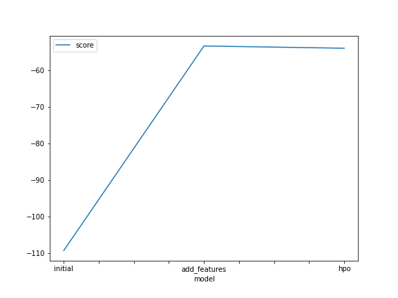
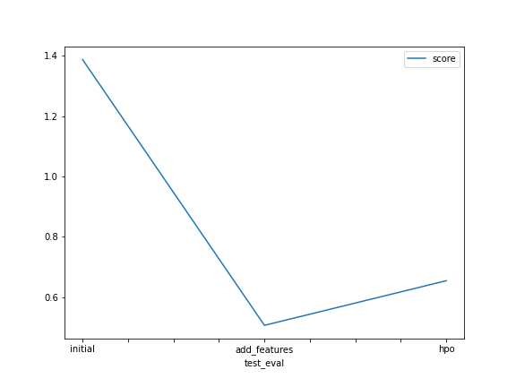

# Report: Predict Bike Sharing Demand with AutoGluon Solution
#### Edgar Villegas

## Initial Training
### What did you realize when you tried to submit your predictions? What changes were needed to the output of the predictor to submit your results?
I needed to add the predictions column and to remove the negative values before submission

### What was the top ranked model that performed?
Weighted Ensemble L3 got the best score
```
*** Summary of fit() ***
Estimated performance of each model:
                     model   score_val  pred_time_val    fit_time    
0      WeightedEnsemble_L3 -109.237434       5.625399  564.826160    
1   NeuralNetFastAI_BAG_L2 -109.968287       4.228450  506.708870    
2        LightGBMXT_BAG_L2 -110.537837       3.923794  395.826587    
3          CatBoost_BAG_L2 -110.663565       3.774463  416.675314    
4          LightGBM_BAG_L2 -110.953288       3.820452  392.140994    
5     ExtraTreesMSE_BAG_L2 -111.857784       4.306465  388.171936    
```

## Exploratory data analysis and feature creation
### What did the exploratory analysis find and how did you add additional features?
The EDA showed interesting feature distributions. Most remarkably it showed peaks by the end of the year (month) but 
specially in specific hours, which probably meant that these features were relevant.
That's why we decided to replace the datetime feature by the month, hour and day of week features by 'splitting' it 
with pandas api.
Also, we transformed the categorical features to 'category' datatype.

### How much better did your model preform after adding additional features and why do you think that is?
The score improved significantly. Model score from -109.24 (without features) to -53.43 (with features, higher is better).
Kaggle score also improved from 1.387 to 0.506 (lower is better).

````
*** Summary of fit() ***
Estimated performance of each model:
                     model   score_val  pred_time_val    fit_time 
0      WeightedEnsemble_L3  -53.431359       7.343370  547.718944  
1          CatBoost_BAG_L2  -53.788290       6.627125  539.309042  
2     ExtraTreesMSE_BAG_L2  -53.881347       7.119274  381.470509  
3          LightGBM_BAG_L2  -54.091284       6.707213  384.186549  
4      WeightedEnsemble_L2  -54.423457       5.818970  378.213056  
5   RandomForestMSE_BAG_L2  -54.816518       7.108106  385.121623  
````

I think this is because hour, month and weekday contribute significantly to the model.  
This can be confirmed with the feature importance obtained by autogluon; In fact, the top features obtained with 
`predictor.feature_importance()` are *hour, temp, workingday, humidity, day_of_week, month*. Specially *hour* is a crucial 
feature, so adding it improved the model accuracy considerably.	   

## Hyper parameter tuning
### How much better did your model preform after trying different hyper parameters?
Surprisingly, it didn't improve (model score -53.4 to -54.04, kaggle score 0.506 to 0.654, both inferior). 
I couldn't beat the 'best_quality' preset even by trying with several 
combinations of hyperparameters (BTW it was not easy. Many hyperparameter configurations threw critical exceptions so 
I was very limited with the experiments). Indeed, even leaving some tuned models training for long periods of time did not improve
significantly over the 'best_quality' preset.  
My conclusion is that this is really well optimized. For sure it can be beaten, but my knowledge to achieve it is 
not enough yet. 

```
*** Summary of fit() ***
Estimated performance of each model:
                    model   score_val  pred_time_val    fit_time 
0     WeightedEnsemble_L2  -54.036966       7.026965  242.794181  
1     WeightedEnsemble_L3  -54.293186       8.173261  336.342597  
2      LightGBM_BAG_L2\T6  -54.353889       7.358981  249.923174  
3      LightGBM_BAG_L2\T5  -54.368682       7.295980  246.854872  
4      LightGBM_BAG_L2\T7  -54.427476       7.309017  247.670880  
5       XGBoost_BAG_L2\T2  -54.556584       7.443957  319.144461  
```

### If you were given more time with this dataset, where do you think you would spend more time?
I would spend more time studying the different models to learn how to optimize them via hyperparam optimization.
Probably I would narrow the attempted models to Weighted Ensemble L3 and possibly the rest of the top 3.

### Create a table with the models you ran, the hyperparameters modified, and the kaggle score.
|model|time|num_bag_folds|num_stack_levels|num_bag_sets|hyperparameters|hp_tune_kwargs|score|
|--|--|--|--|--|--|--|--|
|initial|600|None|None|None|None|None|1.387|
|add_features|600|None|None|None|None|None|0.506|
|hpo|1200|8|2|1|GBM, XGB, LR|auto|0.654|

### Create a line plot showing the top model score for the three (or more) training runs during the project.



### Create a line plot showing the top kaggle score for the three (or more) prediction submissions during the project.



## Summary
We were able to succesfully create and use an automatic ML model for Kaggle's bikesharing dataset using AutoGluon.
1) Autogluon 'as is' (default data, default autogluon config) was able to obtain a Kaggle score of 1.387, with Weighted
Ensemble L3 model.
2) By feature engineering (adding hour, month and day of wek features), the model's accuracy improved significantly, 
to 0.506 kaggle score, using also Weighted Ensemble L3 model. This was the best model we obtained in the project.
3) Autogluon's 'best_quality' preset is extremely effective. We couldn't beat it by tuning hyperparameters, mainly
due to lack of experience. Even by configuring stack params and GBM, XGB, LR hyperparams and running double time we got 
an inferior score (0.654). The autoselected model was Weighted Ensemble L2.
